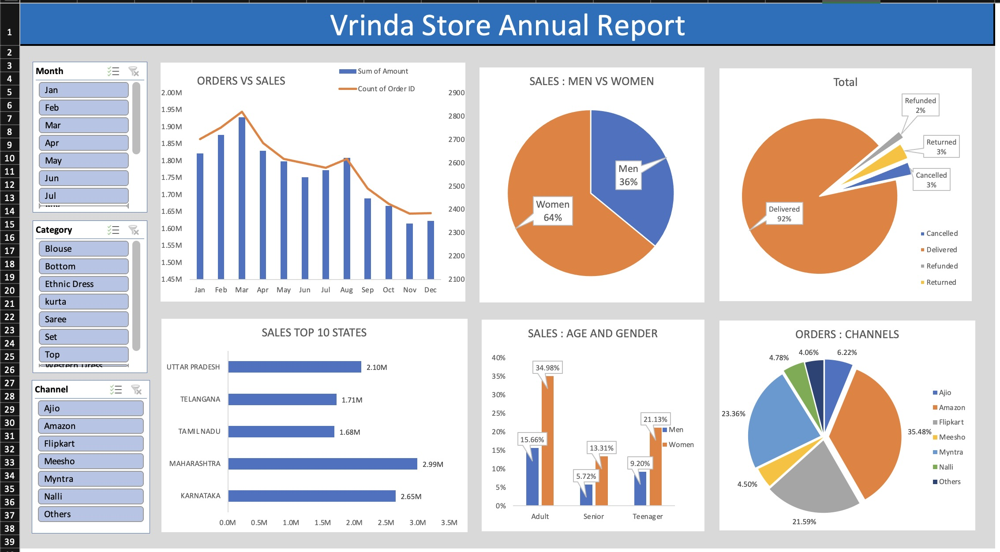

# Vrinda Store Annual Report Dashboard

## Project Overview

**Project Title**: Vrinda Store Annual Report Dashboard  
**Tool Used**: Microsoft Excel  
**Project Type**: Sales Data Analysis & Interactive Dashboard

This project focuses on analyzing Vrinda Store sales data and creating an interactive annual sales dashboard in Excel. The dashboard provides insights into sales performance, customer demographics, order status, top-performing states, and sales channels.

The objective of this project is to transform raw sales data into meaningful business insights using data cleaning, pivot tables, charts, and slicers.

---

# Dashboard Preview

---

# Objectives

1. Analyze annual sales performance of Vrinda Store.
2. Identify sales trends and order patterns.
3. Compare sales contribution by men and women.
4. Analyze customer age groups and purchasing behavior.
5. Identify top-performing states based on sales.
6. Analyze order channels such as Amazon, Myntra, Ajio, etc.
7. Build an interactive dashboard using Excel.

---

# Dashboard Insights

## Orders vs Sales

- Monthly sales and order trends were analyzed.
- March recorded the highest sales and order volume.
- Sales gradually declined towards the end of the year.

---

## Sales: Men vs Women

- Women contributed approximately **64%** of total sales.
- Men contributed approximately **36%** of total sales.

This indicates that women were the primary customer segment for Vrinda Store.

---

## Order Status Analysis

- Delivered orders accounted for approximately **92%** of all orders.
- Cancelled, refunded, and returned orders made up a very small percentage.

This suggests strong operational performance and successful order fulfillment.

---

## Sales Top 10 States

The top-performing states included:

- Maharashtra
- Karnataka
- Uttar Pradesh
- Telangana
- Tamil Nadu

Maharashtra generated the highest sales overall.

---

## Sales: Age and Gender

- Adult women contributed the highest share of sales.
- Teenagers and seniors contributed comparatively lower sales.
- Female customers dominated sales across all age categories.

---

## Orders: Channels

Sales channels analyzed:

- Amazon
- Myntra
- Flipkart
- Ajio
- Meesho
- Nalli
- Others

Amazon generated the highest share of orders among all platforms.

---

# Key Business Findings :

**The analysis showed that women accounted for approximately 64% of total sales, making them the primary customer segment. Sales were strongest among adult customers, while teenagers and senior customers contributed a smaller share of revenue.**

**From a geographic perspective, Maharashtra generated the highest sales, followed by several other high-performing states. Channel analysis revealed that Amazon was the largest contributor to order volume, outperforming other marketplaces such as Myntra, Flipkart, and Ajio.**

**Operational performance was also strong, with approximately 92% of orders successfully delivered, while cancelled, returned, and refunded orders represented only a small proportion of total transactions. Monthly analysis showed that sales peaked during March, with performance gradually declining toward the end of the year.**

# Files Included

- `Vrinda Store Data Analysis.xlsx`
- `Dashboard.jpeg`
- `README.md`
